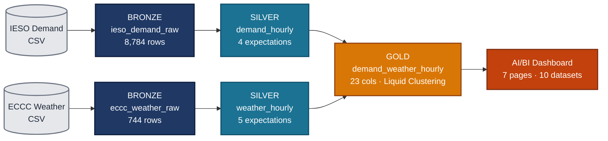
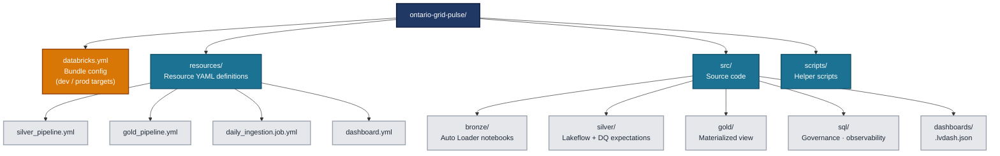

# Ontario Grid Pulse

> **A production-grade Azure Databricks Lakehouse** correlating Ontario's electricity demand with Toronto weather — built end-to-end across every layer of the modern data stack.

---

## What this project is

A complete Lakehouse implementation on Azure Databricks that ingests hourly electricity demand from IESO (Independent Electricity System Operator) and hourly weather data from ECCC (Environment and Climate Change Canada), reconciles them to UTC, applies data quality expectations, joins them into a feature-engineered Gold table, and surfaces the result through a governed AI/BI dashboard.

Built across **12 phases** covering infrastructure, ingestion, transformation, governance, orchestration, CI/CD, and analytics delivery.

## Key Analytical Findings

| Finding | Detail |
|---|---|
| **Thermal sensitivity** | Demand nearly doubles between mild and extreme-hot conditions (12,390 MW → 23,122 MW — a 1.87× multiplier). |
| **Peak window** | Daily peak concentrates **14:00–20:00 local**. Weekday-weekend gap of 1,500–2,500 MW during 8 AM–5 PM proves the commercial/industrial load signature. |
| **Net-import anomalies** | 16 hours in 2024 (0.18%) had Ontario importing more than exporting — all clustered in spring shoulder season when Quebec hydro surpluses flow south. Documented as findings, not data errors. |

---

## Tech Stack

| Layer | Technology |
|---|---|
| **Cloud** | Azure (ADLS Gen2, Access Connector, Managed Identity, Premium workspace with SCC) |
| **Compute** | Databricks Serverless + Single-Node cluster |
| **Ingestion** | Auto Loader (`cloudFiles`, `availableNow` trigger) |
| **Transformation** | Lakeflow Spark Declarative Pipelines (`@dlt`) |
| **Governance** | Unity Catalog (RBAC + ABAC: row filters, column masks), System Tables |
| **Performance** | Liquid Clustering, Predictive Optimization, Change Data Feed |
| **Orchestration** | Lakeflow Jobs (DAG with retries, schedules, notifications) |
| **CI/CD** | Databricks Asset Bundles (`databricks bundle deploy --target {dev,prod}`) |
| **Analytics** | AI/BI Dashboard (7 pages, 10 datasets, fully bundle-managed `.lvdash.json`) |
| **Languages** | Python (PySpark), SQL, YAML, Bash |

## Engineering Practices Demonstrated

- **Medallion architecture** with strict layer separation
- **9 data quality expectations** (drop and warn) with documented anomaly handling
- **UTC normalization** across heterogeneous source timezone conventions (IESO EST hour-ending, ECCC LST)
- **Attribute-based access control** — row filters and column masks at Silver, propagating to Gold
- **Predictive Optimization + Liquid Clustering** for query performance
- **System table observability** — audit, lineage (table + column), billing usage
- **Multi-environment CI/CD** with environment-aware variables (`${bundle.target}`)
- **Cost discipline** — ~91 DBUs (~$50 CAD) for the entire project, monitored via `system.billing.usage`

---

## What's Out of Scope (Production Hardening Roadmap)

Honest scope tracking — these would be the next iteration:

- Backfill ECCC weather to full year (currently July 2024 sample)
- File-arrival triggers (replacing scheduled triggers)
- Multi-station weather coverage for province-wide modeling
- Service principal isolation for prod (currently runs as user)
- GitHub Actions CI for `bundle validate` on every PR
- Cost monitoring dashboard built on `system.billing.usage`
- Terraform/Bicep for Azure infrastructure provisioning (currently click-ops)

---

## About

Built by **Arsalan Eslami** — Senior Data Engineer in Newmarket, Ontario.

Currently exploring **Senior Azure Databricks Engineer** opportunities. Open to roles at energy & utility companies, Databricks consulting partners, and enterprises building lakehouse platforms.

📧 arsalaneslami@gmail.com  
🔗 [LinkedIn](https://www.linkedin.com/)

---

*Project documentation, deployment runbook, and architectural diagrams available on request.*
